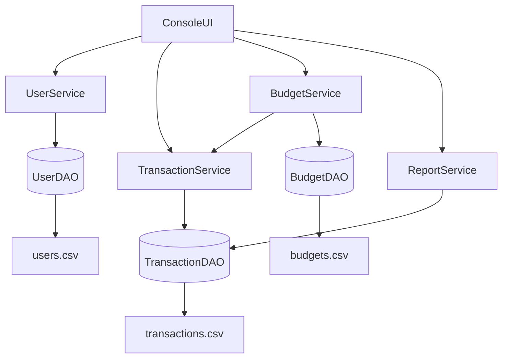

# Architecture

```mermaid
flowchart TD
    UI[ConsoleUI] --> US[UserService]
    UI --> TS[TransactionService]
    UI --> BS[BudgetService]
    UI --> RS[ReportService]
    BS --> TS
    US --> UDAO[(UserDAO)]
    TS --> TDAO[(TransactionDAO)]
    BS --> BDAO[(BudgetDAO)]
    RS --> TDAO
    UDAO --> UCSV[users.csv]
    TDAO --> TCSV[transactions.csv]
    BDAO --> BCSV[budgets.csv]
```

Layers: UI (console I/O only) -> Service (business rules) -> DAO (storage). Swapping CSV for a database only requires new DAO implementations.
